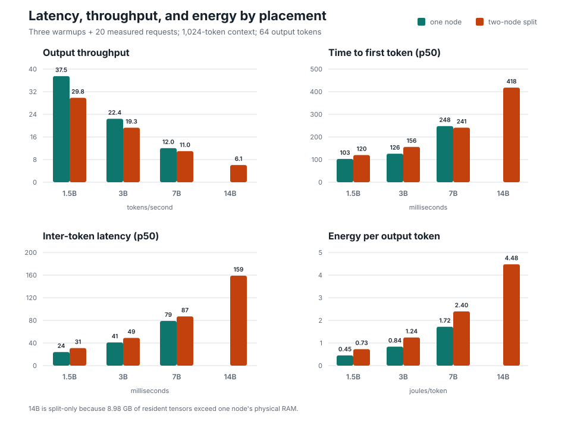

# JetsonFabric

Distributed pipeline-parallel LLM inference for NVIDIA Jetson clusters.

JetsonFabric makes a group of Jetson devices behave like one logical inference
system. Every machine runs the same Go node process for discovery, membership,
coordinator election, deployment planning, and the public API. Each node
supervises a C++ runtime worker that executes its assigned transformer layers
through `llama.cpp` and CUDA.

Two physical Jetson Orin Nano 8 GB nodes now run one model across contiguous
layer ranges over wired Ethernet. Qwen2.5-Coder 32B Q2_K demonstrates an
11.46 GiB resident-weight capacity that cannot fit on either node. A balanced
1.5B pipeline also demonstrates a concurrent serving benefit, while one node
remains faster for a single active request.

JetsonFabric is an experimental source release, not production-ready software.
Traffic currently assumes a trusted LAN and installation is source-based.
Detailed contracts and operator guides are indexed in
[docs/README.md](docs/README.md).

## How It Works

```text
OpenAI-compatible client
  -> any jetsonfabric-node
  -> elected coordinator
  -> deployment plan
  -> stage-0 runtime GenerationRunner
  -> local assigned layers
  -> binary Stagewire activation
  -> peer runtime directly, or peer node facade in relay mode
  -> final logits and sampled token
  -> buffered response or SSE stream
```

For a two-stage pipeline:

```text
prefill: prompt -> stage 0 -> activation -> stage 1 -> sampled token
decode:  token  -> stage 0 -> activation -> stage 1 -> sampled token
```

The coordinator handles control-plane policy once per request. Runtime workers
own the latency-sensitive prefill/decode loop, direct activation transfer,
stage-local KV state, sampling, cancellation, and cleanup.

Implemented behavior includes:

- identical `jetsonfabric-node` processes with static and mDNS discovery;
- deterministic coordinator election and fresh peer membership;
- versioned deployment plans with model hashes, epochs, and layer assignments;
- partial-layer `llama.cpp` execution for Llama and Qwen2-family models;
- stage-local model-weight residency and persistent prefill/decode contexts;
- registered F32 and F16 activation codecs over binary Stagewire transport,
  with byte-count and CRC validation;
- dynamic load, activate, drain, and unload without restarting the node;
- active-deployment repair after an empty runtime process restarts;
- bounded runtime HTTP workers and persistent ordered connections to peer nodes;
- selectable relay and direct runtime-to-runtime HTTP transports;
- opt-in multi-session continuous decode batching through one native
  `llama_decode` batch;
- opt-in prompt-lookup speculative decoding with target verification and
  distributed KV-cache rollback;
- experimental direct-runtime tensor sharding over trusted-LAN GGML RPC;
- OpenAI-compatible buffered and streaming chat completions through any node.

See [the architecture](docs/architecture.md) for component ownership and
[Stagewire v2](docs/stagewire-v2.md) for the inter-stage frame contract.

## Measured Results

The physical test cluster used two Jetson Orin Nano 8 GB nodes in MAXN_SUPER
mode over wired 1 GbE. Tests used greedy Qwen2.5-Coder GGUF models and verified
token counts against final usage. Detailed reports preserve the exact model,
quantization, context, output length, concurrency, and sample count.

### Pareto Frontier

| Objective | Configuration | Best measured result |
| --- | --- | --- |
| Maximum aggregate throughput | 1.5B, two replicas | **80.06 output tok/s** |
| Performance/quality knee | 7B, two replicas | **24.63 aggregate tok/s**, 84.1% HumanEval+ |
| Largest Pareto model | 14B, 26/22 pipeline | **12.19 aggregate tok/s**, 86.6% HumanEval+ |
| Maximum demonstrated capacity | 32B Q2_K, 33/31 pipeline | **11.46 GiB resident weights**, 5.149 aggregate tok/s |

Replica and pipeline throughput above use the concurrency-two serving matrix.
HumanEval+ used one greedy sample for each of 164 EvalPlus tasks. The 32B model
proved capacity, but did not improve HumanEval+ over 14B and reduced throughput.




### Matched 14B Architecture Comparison

The same Q4_K_M model, prompt, 2,048-token context, 32-token output, and exact
token sequence were used for the pipeline and tensor runs.

| Mode | Placement | TTFT mean | ITL mean | E2E mean | Decode tok/s | J/token | Captured wire traffic |
| --- | --- | ---: | ---: | ---: | ---: | ---: | ---: |
| Pipeline | 24/24 layers | **361 ms** | **154 ms** | **5.14 s** | **6.50** | **4.25** | **3.2 MB** |
| Tensor | 60/40 weights | 1,096 ms | 596 ms | 19.58 s | 1.68 | 11.36 | 6.55 GB |

Wire counters covered one warmup plus three measured requests. Power and
latency metrics cover the three measured requests. Tensor sharding was correct,
but repeated intra-layer collectives made it network-bound on 1 GbE.

### Native Engine Correctness Baseline

The experimental JetsonFabric-native Qwen2 graph reproduced the exact greedy
token sequence from the pinned llama.cpp oracle on CPU and CUDA. On one Orin
Nano with Qwen2.5-Coder 1.5B Q4_K_M, CUDA measured 100.84 ms p50 TTFT and
8.66 tok/s p50 repeated full-prefix decode across ten samples. This path does
not yet use a KV cache and is not comparable to the serving results above. See
the [native inference baseline](docs/benchmarks/2026-08-01-native-inference-baseline.md).

### Findings

- **Use replicas when the model fits.** They produced the highest aggregate
  throughput for 1.5B, 3B, and 7B.
- **Use pipeline parallelism for capacity.** It served 14B and 32B models that
  cannot fit on one 8 GB node.
- **7B is the measured performance/quality knee.** The 7B-to-14B HumanEval
  difference was not statistically significant on 164 tasks.
- **Continuous decode batching is implemented but remains opt-in.** The
  physical concurrency sweep did not beat unbatched execution on these nodes.
- **Tensor parallelism needs a faster interconnect.** It preserved exact tokens
  but was 3.9x slower in decode than the pipeline over 1 GbE.

Detailed methodology and claim boundaries:

- [model scaling and HumanEval](docs/benchmarks/2026-07-27-two-orin-nano.md);
- [serving matrix](docs/benchmarks/2026-07-29-serving-matrix.md);
- [32B capacity](docs/benchmarks/2026-07-30-32b-capacity.md);
- [runtime transport, batching, and speculation](docs/benchmarks/2026-07-31-runtime-transport-speculation.md);
- [tensor runtime comparison](docs/benchmarks/2026-08-01-tensor-parallel-runtime.md).

## Quick Start

### Requirements

- Linux development host or NVIDIA Jetson;
- Go toolchain specified by `go.mod`;
- CMake and a C++20 compiler;
- `curl`, `jq`, and standard build utilities;
- a compatible GGUF model;
- CUDA toolkit for GPU builds on Jetson.

### Run One Node

```sh
git clone https://github.com/SamJSui/jetsonfabric.git
cd jetsonfabric
cp .env.example .env.local
```

Set the model identity and local artifact path:

```dotenv
MODEL=qwen2.5-coder-1.5b-q4
MODEL_PATH=/absolute/path/to/model.gguf
```

For CPU-only development:

```dotenv
RUNTIME_COMPUTE_BACKEND=cpu
RUNTIME_N_GPU_LAYERS=0
```

Build, test, and launch one node supervising one full-model runtime:

```sh
make setup
make test
make dev-up
```

Successful startup ends with:

```text
JetsonFabric development node is ready.

Model:    qwen2.5-coder-1.5b-q4
Layers:   [0,28)
Pipeline: stage 0 of 1
Backend:  cpu
Node:     http://127.0.0.1:19180
Runtime:  http://127.0.0.1:19190
```

Inspect the node and issue a completion from another terminal:

```sh
make dev-status
make dev-chat DEV_PROMPT='Explain JetsonFabric in one sentence.' DEV_MAX_TOKENS=16
make kill
```

`make dev-status` includes health, membership, runtime state, and a route
preview. `make dev-chat` prints an OpenAI-compatible response:

```json
{
  "object": "chat.completion",
  "model": "qwen2.5-coder-1.5b-q4",
  "choices": [
    {
      "message": {
        "role": "assistant",
        "content": "JetsonFabric ..."
      },
      "finish_reason": "length"
    }
  ]
}
```

Generated IDs, timestamps, text, and token counts vary by run.

### Join Two Jetsons

Build and install the CUDA runtime on each Jetson. Both nodes need the same
model artifact hash and cluster token; the local artifact path may differ.

```sh
make node-linux-arm64
make runtime-cuda RUNTIME_CUDA_ARCH=87
sh scripts/install-node-layout.sh
```

Start both nodes with `--runtime-idle`. Once membership converges, switch a
two-stage deployment and prompt through either node:

```sh
curl -sS http://dopey.local:52415/v1/cluster/members | jq

curl -sS -X POST http://dopey.local:52415/v1/deployments/switch \
  -H 'Content-Type: application/json' \
  --data-binary @examples/deployment-switch-request.json | jq

curl -sS -X POST http://grumpy.local:52415/v1/chat/completions \
  -H 'Content-Type: application/json' \
  --data-binary @examples/chat-request.json | jq
```

Deployment requests may optionally provide measured layer counts, for example
`"stage_layer_counts": [18, 10]`. Counts must be positive, match the stage
count, and sum to the model's transformer layer count. Equal layer allocation
remains the default.

`dopey` and `grumpy` are example hostnames. Requests sent to a non-coordinator
node are forwarded through the node facade. The [node join guide](docs/node-join.md)
contains the complete trusted-LAN configuration and model-registry example.

## Development

The primary build and validation commands are:

```sh
gofmt -w ./cmd ./internal ./tools
go test ./...
make build
```

Explicit targets:

```sh
make node
make runtime
make runtime-cuda RUNTIME_CUDA_ARCH=87
```

Real-model integration:

```sh
make test-integration-single \
  MODEL_PATH=/absolute/path/to/model.gguf \
  MODEL=qwen2.5-coder-1.5b-q4

make test-integration-pipeline \
  MODEL_PATH=/absolute/path/to/model.gguf \
  MODEL=qwen2.5-coder-1.5b-q4
```

Pipeline activations use lossless `f32` by default. Select the registered `f16`
codec to halve activation bytes at each inter-stage boundary:

```sh
make test-integration-pipeline \
  MODEL_PATH=/absolute/path/to/model.gguf \
  MODEL=qwen2.5-coder-1.5b-q4 \
  RUNTIME_ACTIVATION_ENCODING=f16
```

All nodes in a deployment must advertise the same activation encoding. Engines
continue to consume and produce `f32`; the runtime codec owns only the wire
conversion, independently of the engine and stage transport.

Configuration stays separated by purpose:

| Path | Purpose |
| --- | --- |
| `.env.example` | Developer-machine environment template. |
| `configs/models.example.json` | Model registry and planning metadata example. |
| `examples/*.json` | Executable API and benchmark request bodies. |

Do not commit GGUF files, cluster tokens, host-specific paths, generated plans,
or mutable node state.

## Roadmap

The distributed runtime, physical CUDA proof, sustained 32B capacity run,
runtime restart repair, and persistent peer connection baseline are complete.
Current work is:

1. **Harden the memory boundary:** estimate weights, KV, activations, compute
   buffers, fragmentation, and replacement overlap before admitting a plan.
2. **Improve pipeline utilization:** profile decode kernels and evaluate
   chunked prefill against long-prompt TTFT. Continuous decode batching is
   already implemented and remains opt-in based on physical results.
3. **Operator and recovery experience:** package services, distribute models,
   expose repeatable benchmarks, and automate node-loss acceptance tests.
4. **Jetson-native engine:** JFM v2 packaging, exact stage selection, integrity
   validation, optimized NVMe first-touch, and one-node Qwen2 greedy parity on
   CPU and CUDA are complete. Add tokenizer, KV-cache, and lifecycle parity
   before registering the native path for serving or splitting its graph.

After those are stable:

- add per-node identity, TLS, and secure cluster admission;
- persist coordinator intent and deployment state across leader failure;
- add structured metrics and traces;
- evaluate additional measured activation codecs;
- integrate tensor placement into coordinator lifecycle only after transport
  authentication and faster-link measurements justify the added complexity.

## Current Limitations

- Partial-layer support is limited to Llama and Qwen2-family graphs through a
  patch tied to the pinned `llama.cpp` revision.
- Reported model residency covers tensor payloads, not allocator overhead,
  compute buffers, KV cache, fragmentation, or replacement overlap.
- Runtime HTTP serving is bounded to two workers by default. Stage adapters
  serialize native execution calls; optional continuous batching coalesces
  concurrent decode steps into one call.
- Peer operations reuse one ordered HTTP/1.1 connection per target; they are
  not multiplexed and do not overlap microbatches.
- The `f16` activation codec uses scalar CPU conversion; physical benchmarks
  must determine whether lower wire volume offsets conversion cost.
- Chat completions use greedy sampling.
- Stage traffic uses a shared cluster token over plaintext HTTP. Use only a
  trusted network.
- Experimental tensor execution uses raw unauthenticated GGML RPC and bypasses
  coordinator lifecycle management. It is restricted to trusted-LAN research.
- The native JFM path performs experimental one-node Qwen2 greedy generation
  from token IDs, but reloads the full model and recomputes the full prefix for
  every token. llama.cpp remains the serving engine and correctness oracle
  while tokenization, KV cache, lifecycle, and distributed-stage parity are
  implemented and validated.
