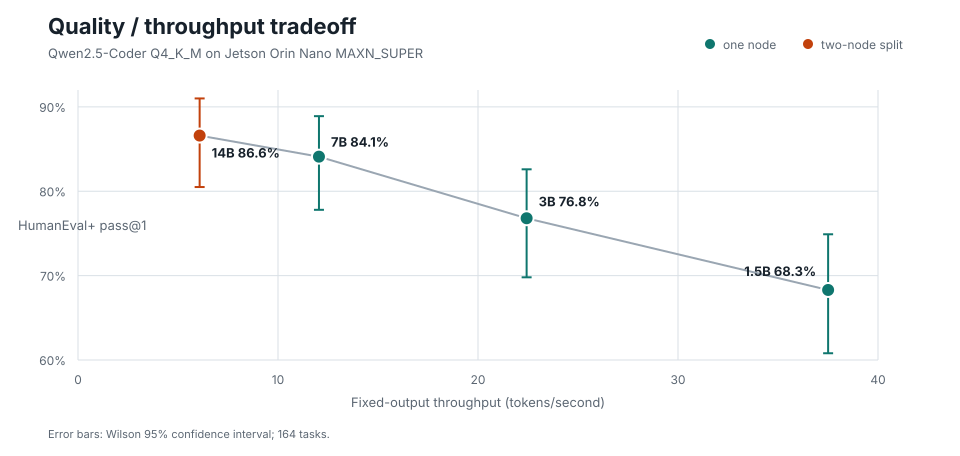

# JetsonFabric

Distributed LLM inference for small NVIDIA Jetson clusters.

JetsonFabric makes multiple Jetsons behave like one logical inference system.
Every machine runs the same Go node process for discovery, membership,
coordinator election, deployment planning, and the public API. A node-local
C++/CUDA runtime owns model execution, KV state, and latency-sensitive stage
communication.

Two Jetson Orin Nano 8 GB nodes have served Qwen2.5-Coder models across
contiguous layer ranges over wired Ethernet. The cluster demonstrated 11.46 GiB
of resident 32B Q2_K weights that cannot fit on either node alone. Pipeline
parallelism extends model capacity; the native 1.5B pipeline also produced the
highest aggregate throughput measured on this cluster.

JetsonFabric is experimental source software for trusted-LAN research, not a
production inference service. See [the documentation index](docs/README.md) for
complete contracts, setup guides, and benchmark provenance.

## Architecture

```text
OpenAI-compatible client
  -> any jetsonfabric-node
  -> elected coordinator and deployment plan
  -> stage-0 C++ runtime
  -> local transformer layers
  -> binary Stagewire activation
  -> peer runtime
  -> final logits and sampled token
  -> buffered response or SSE stream
```

The Go node owns discovery, membership, election, planning, facade routing,
and lifecycle coordination. C++ owns model execution, partial-layer residency,
stage-local KV caches, sampling, and direct runtime transport. The coordinator
selects the route once; it is not in the token-by-token data path.

The default serving path uses a pinned `llama.cpp` integration. A selectable
JetsonFabric-native Qwen2 engine also executes contiguous layer stages from JFM
packages through the same API using GGML/GGML-CUDA directly. This boundary
keeps engine and transport implementations replaceable without changing the
node API.

Implemented behavior includes:

- identical nodes with static and mDNS discovery and deterministic election;
- versioned deployment plans with model hashes, epochs, and layer assignments;
- partial-layer llama.cpp and native Qwen2 execution with stage-local weight
  residency and integrity-checked GGUF or JFM artifacts;
- dynamic load, activate, drain, unload, and runtime-restart repair;
- F32 and F16 activation codecs over direct or relayed Stagewire transport;
- optional continuous decode batching, prompt-lookup speculation, and
  experimental tensor sharding; and
- OpenAI-compatible buffered and streaming chat completions through any node.

See [architecture](docs/architecture.md),
[the codebase catalog](docs/architecture/codebase-catalog.md), and
[Stagewire v2](docs/stagewire-v2.md) for ownership and protocol details.

## Measured Results

Physical serving tests used two Jetson Orin Nano 8 GB nodes in `MAXN_SUPER`
over wired 1 GbE. Results use greedy Qwen2.5-Coder GGUF models; detailed reports
record model hashes, quantization, context, output length, concurrency, power,
and sample counts.

| Objective | Configuration | Best measured result |
| --- | --- | --- |
| Maximum aggregate throughput | 1.5B, native 18/10 pipeline | **86.79 output tok/s** |
| Performance/quality knee | 7B, two replicas | **24.63 aggregate tok/s**, 84.1% HumanEval+ |
| Largest Pareto model | 14B, native 26/22 pipeline | **12.51 aggregate tok/s**, 86.6% HumanEval+ |
| Maximum demonstrated capacity | 32B Q2_K, 33/31 pipeline | **11.46 GiB resident weights**, 5.149 aggregate tok/s |

Replica and pipeline throughput use two concurrent requests. HumanEval+ used
one greedy sample for each of 164 EvalPlus tasks. The 32B model proved capacity
but did not improve HumanEval+ over 14B. In a matched 14B comparison, pipeline
decode reached 6.50 tok/s while experimental tensor sharding reached 1.68 tok/s;
6.55 GB of collectives made tensor execution network-bound on 1 GbE.



The native Qwen2 CUDA engine uses Flash Attention, an aligned F16 KV cache, and
shape-aware SwiGLU fusion. In a matched two-node 1.5B A/B, its 18/10 pipeline
served **86.79 output tok/s** at concurrency 2 versus **75.10 tok/s** for the
pinned llama.cpp engine. Native median TTFT was 76 ms versus 93 ms, median ITL
was 22 ms versus 25 ms, and median end-to-end latency was 2.947 s versus
3.399 s. Both engines produced the same greedy tokens. The native engine also
maps only its assigned JFM layers on each node.

The same native stage path served 3B, 7B, and 14B at **45.00, 24.06, and
12.51 aggregate tok/s** at concurrency 2. Those results are 13.1%, 6.5%, and
2.6% above the repository's equivalent llama.cpp pipeline rows. Native 3B and
7B retained 96.9% and 97.7% of historical two-replica throughput while keeping
only one contiguous weight partition on each node.

Benchmark reports and claim boundaries:
[model scaling and HumanEval](docs/benchmarks/2026-07-27-two-orin-nano.md),
[serving matrix](docs/benchmarks/2026-07-29-serving-matrix.md),
[32B capacity](docs/benchmarks/2026-07-30-32b-capacity.md),
[tensor comparison](docs/benchmarks/2026-08-01-tensor-parallel-runtime.md),
[native engine matrix](docs/benchmarks/2026-08-01-native-engine-matrix.md),
[native CUDA optimization](docs/benchmarks/2026-08-02-native-fused-ffn.md),
[native distributed stages](docs/benchmarks/2026-08-03-native-distributed-stages.md),
and [native model scaling](docs/benchmarks/2026-08-03-native-scaling.md).

## Quick Start

Requirements: Linux or NVIDIA Jetson, the Go version in `go.mod`, CMake, a C++20
compiler, standard build tools, and a compatible GGUF model. CUDA is required
for Jetson GPU builds.

```sh
git clone https://github.com/SamJSui/jetsonfabric.git
cd jetsonfabric
cp .env.example .env.local
```

Set the model identity and artifact path in `.env.local`:

```dotenv
MODEL=qwen2.5-coder-1.5b-q4
MODEL_PATH=/absolute/path/to/model.gguf
```

For CPU-only development, also set:

```dotenv
RUNTIME_COMPUTE_BACKEND=cpu
RUNTIME_N_GPU_LAYERS=0
```

Build, test, start one node, inspect it, and send a completion:

```sh
make setup
make test
make dev-up
make dev-status
make dev-chat DEV_PROMPT='Explain JetsonFabric in one sentence.' DEV_MAX_TOKENS=16
make kill
```

For a two-Jetson CUDA deployment, build and install the same revision on each
node. Both nodes need the same model artifact hash and cluster token; local
artifact paths may differ.

```sh
make node-linux-arm64
make runtime-cuda RUNTIME_CUDA_ARCH=87
sh scripts/install-node-layout.sh
```

Start both nodes with `--runtime-idle`, then switch a deployment and prompt
through either node:

```sh
curl -sS -X POST http://dopey.local:52415/v1/deployments/switch \
  -H 'Content-Type: application/json' \
  --data-binary @examples/deployment-switch-request.json | jq

curl -sS -X POST http://grumpy.local:52415/v1/chat/completions \
  -H 'Content-Type: application/json' \
  --data-binary @examples/chat-request.json | jq
```

`dopey` and `grumpy` are example hostnames. The
[node join guide](docs/node-join.md) contains the complete trusted-LAN setup,
service configuration, model registry, and validation procedure.

## Development

Required source checks:

```sh
gofmt -w ./cmd ./internal ./tools
go test ./...
make build
```

Real-model gates are available through `make test-integration-single` and
`make test-integration-pipeline`. See
[local development](docs/local-development.md),
[testing strategy](docs/testing-strategy.md), and
[native engine development](docs/native-engine.md) for exact commands.

Do not commit GGUF files, cluster tokens, host-specific paths, generated plans,
or mutable node state.

## Current Focus

1. Measure whether pooled or pinned receive buffers remove the remaining
   StageWire decode copy and improve TTFT or ITL without weakening the protocol.
2. Harden admission around weights, KV cache, activations, compute buffers,
   fragmentation, and deployment replacement overlap.
3. Improve packaging, model distribution, recovery tests, and trusted-cluster
   security without putting the coordinator in the token data path.

Current limits: chat sampling is greedy; the native engine supports Qwen2 and
Qwen2.5 only; peer traffic is plaintext on a trusted LAN; tensor RPC is
experimental and unauthenticated; and reported resident weights exclude
runtime allocator overhead, KV cache, activations, and compute buffers.
