# Architecture Diagrams

These SVG diagrams are the visual source of truth for JetsonFabric. They are divided into current implementation and target architecture so future design is not mistaken for merged behavior.

Only diagrams listed here and in [`diagrams/README.md`](diagrams/README.md) are maintained.

## Current implementation

### Codebase map

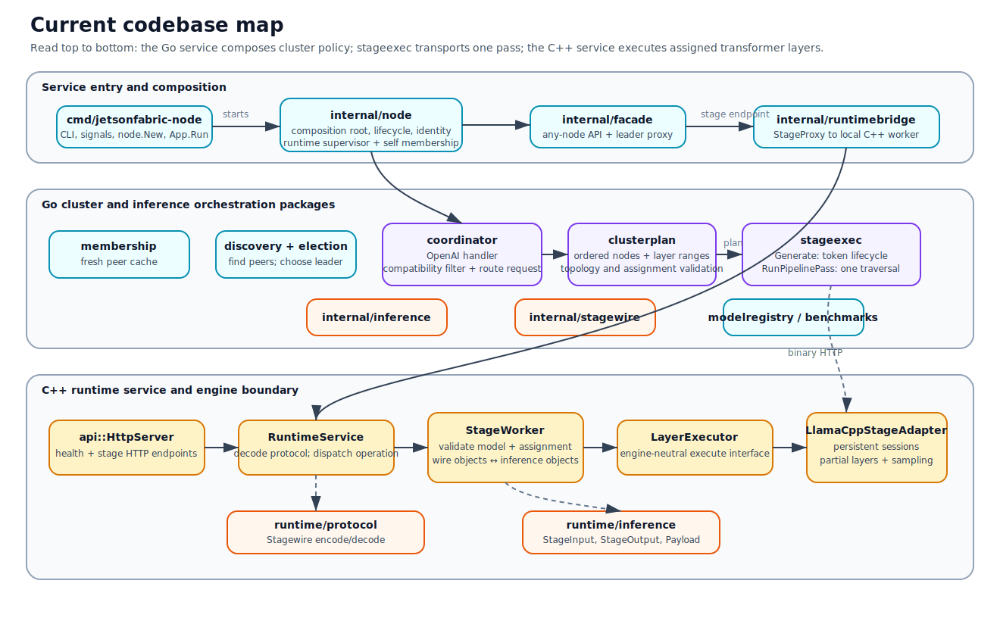

### Go package dependency view

Higher-level packages own policy; lower-level packages own transport and execution mechanisms.

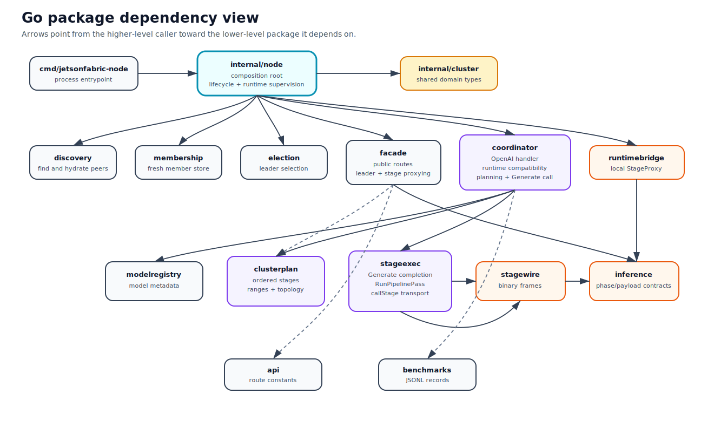

### Type and method contract view

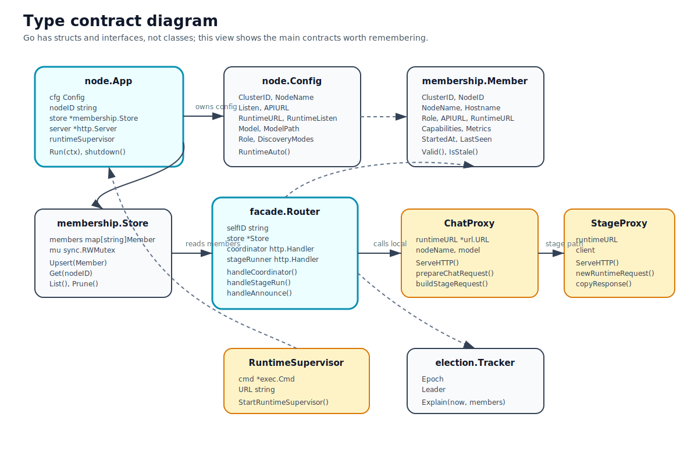

### Current service component view

A client may call any Go node. The elected coordinator coordinates the request through peer node APIs and each node's supervised C++ runtime.

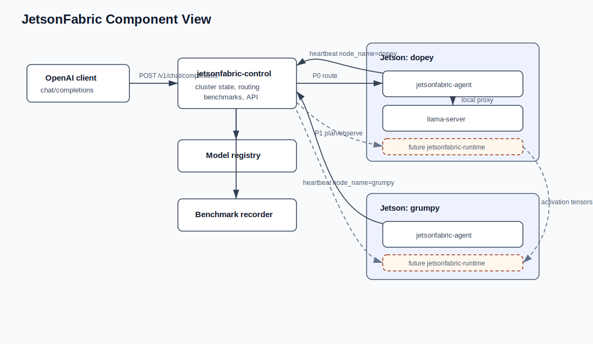

### Startup sequence

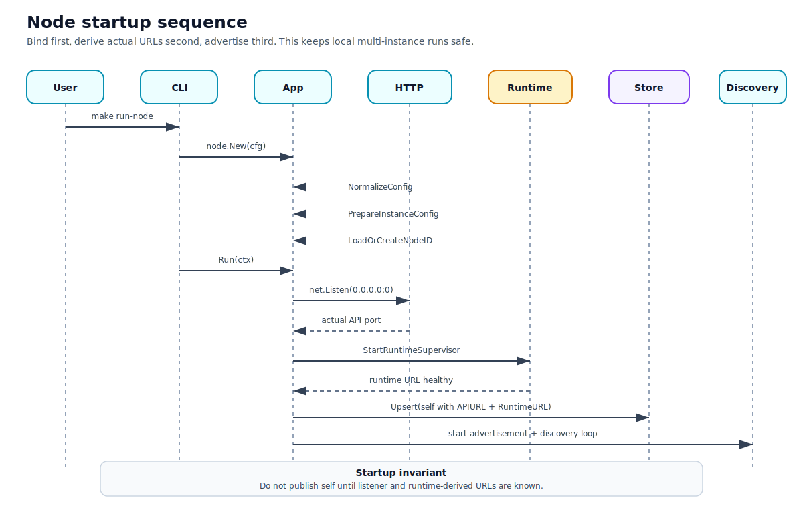

### Deployment and topology

Logical node count and physical host count are separate. Runtime URLs remain local; peer traffic uses node API URLs.

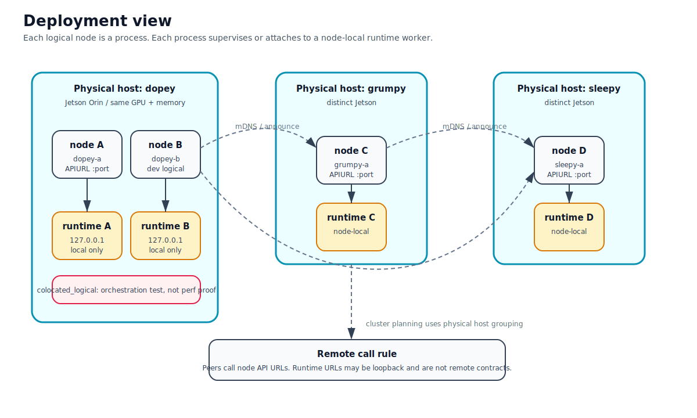

### Test strategy

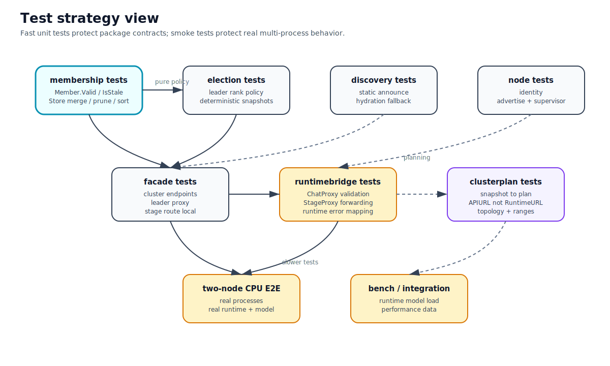

## Generation ownership

### Runtime-owned call stack

Go selects and admits an immutable plan, then makes one generation call. The
stage-0 C++ runtime owns prefill, decode, peer stage transport, cancellation,
and cleanup.

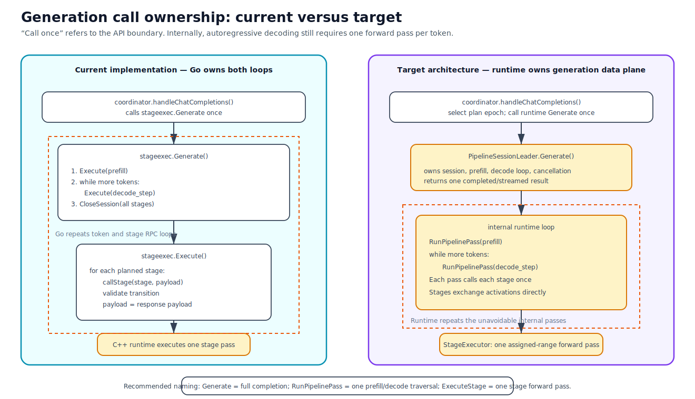

### Current one-call generation sequence

The coordinator selects a prepared plan and calls stage 0 as the runtime
pipeline leader. Token events stream back while the runtime owns prefill,
decode, activation transport, cancellation, and session cleanup.

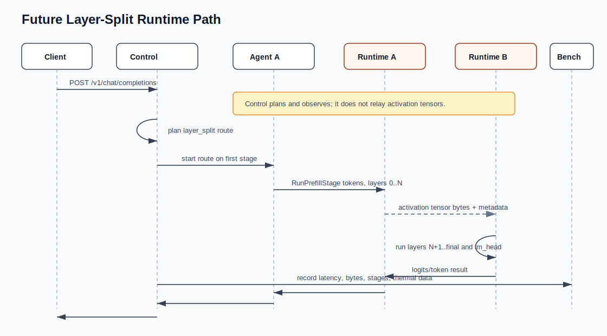

## Target dynamic runtime architecture

These diagrams describe roadmap intent, not current behavior.

### Dynamic model deployment

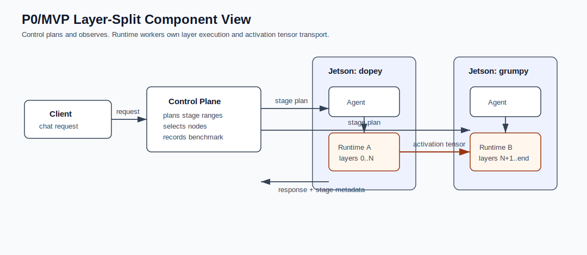

### Model artifact and memory lifecycle

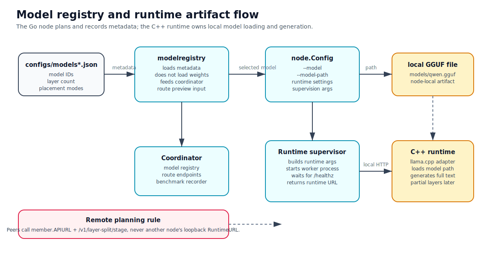

### Safe rebalance

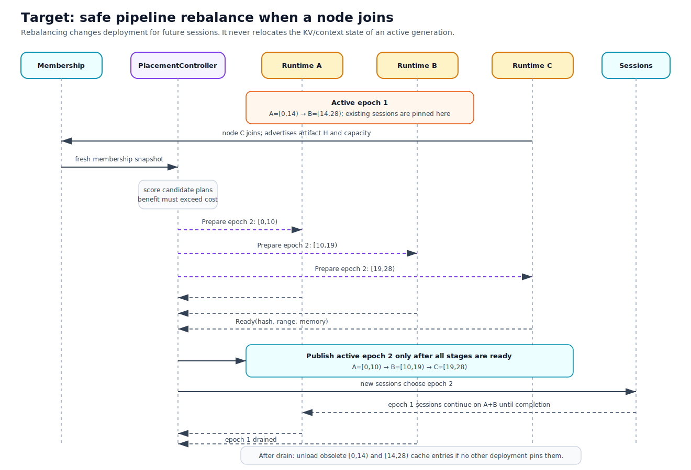
