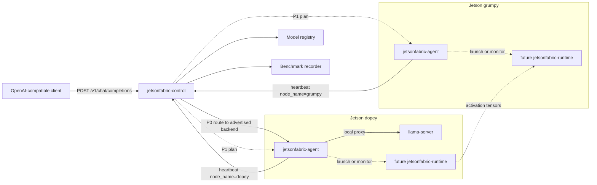
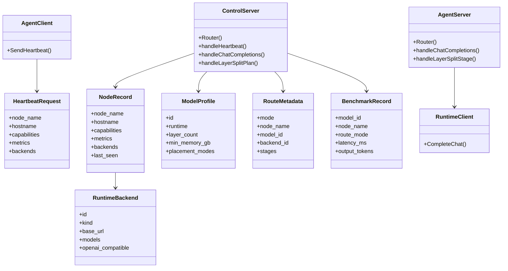
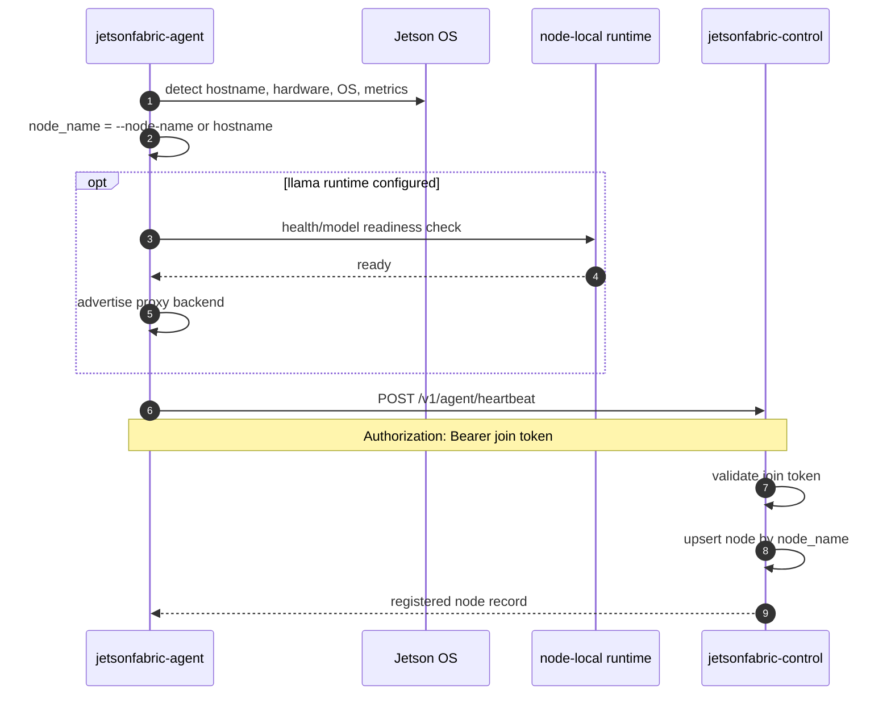
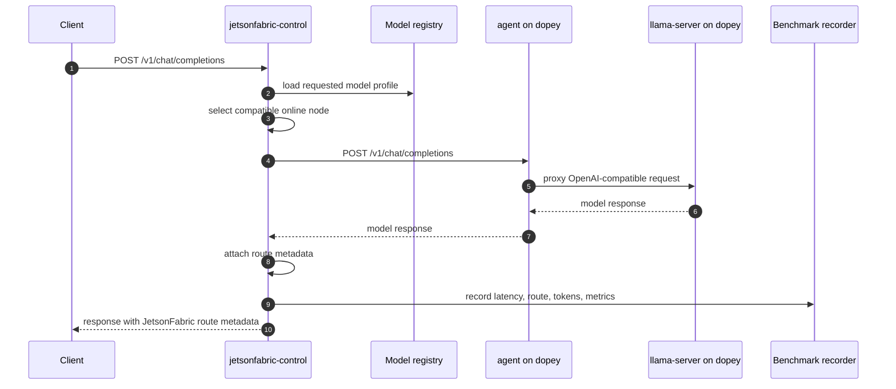
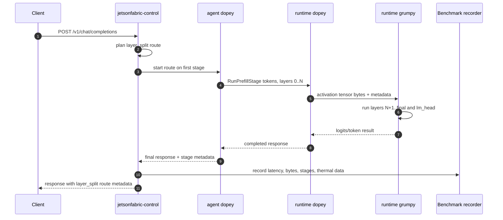
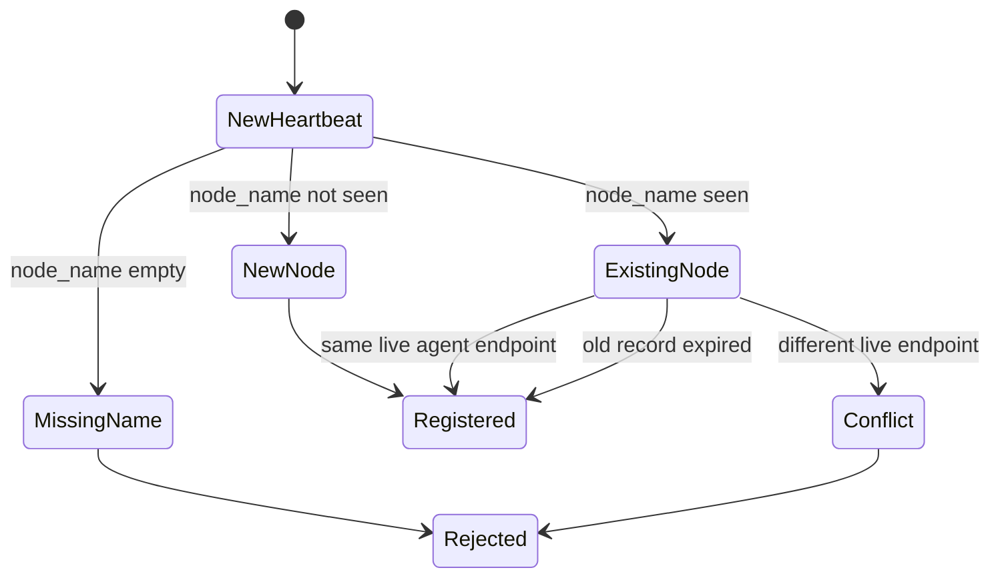

# Architecture Diagrams

These diagrams describe the intended JetsonFabric shape for P0 and the later
layer-split runtime. The P0 path uses an agent proxy to a node-local
`llama-server`. The layer-split diagrams are a design target, not a claim that
real distributed layer execution exists yet.

## Component View

## Go Contract View

This is a struct-level view of the main Go contracts. It is not meant to mirror
every field; it shows ownership and dependency direction.

## Agent Join And Heartbeat

## P0 Prompt Path

## Future Layer-Split Path

In the future layer-split path, the control plane plans and observes. It should
not relay activation tensors.

## Node Name Conflict Policy

For P0, `node_name` is the identity. It defaults to the Jetson hostname, so lab
nodes can be named `dopey`, `grumpy`, and `sleepy`. Duplicate live names are
configuration conflicts rather than names the control plane silently rewrites.

