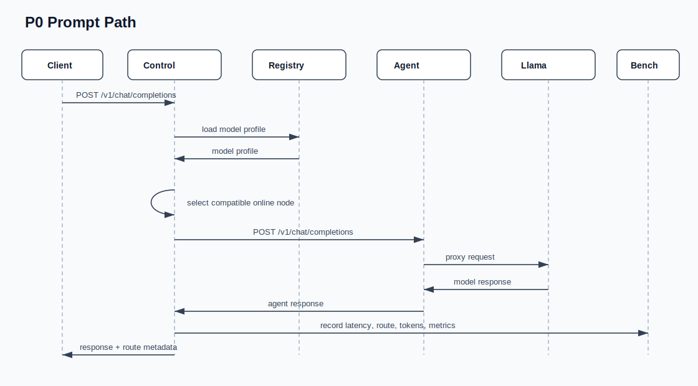

# Architecture Diagrams

These diagrams describe the intended JetsonFabric shape for P0 and the later
layer-split runtime. They are checked in as SVG files so GitHub renders them as
normal markdown images without depending on Mermaid support.

## Component View

## Go Contract View

This is a struct-level view of the main Go contracts. It is not meant to mirror
every field; it shows ownership and dependency direction.

## Agent Join And Heartbeat

## P0 Prompt Path

## Future Layer-Split Path

In the future layer-split path, the control plane plans and observes. It should
not relay activation tensors.

## Node Name Conflict Policy

For P0, `node_name` is the identity. It defaults to the Jetson hostname, so lab
nodes can be named `dopey`, `grumpy`, and `sleepy`. Duplicate live names are
configuration conflicts rather than names the control plane silently rewrites.
