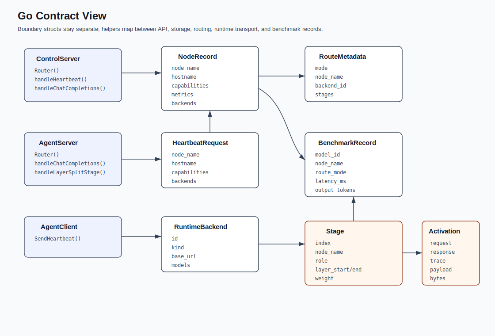
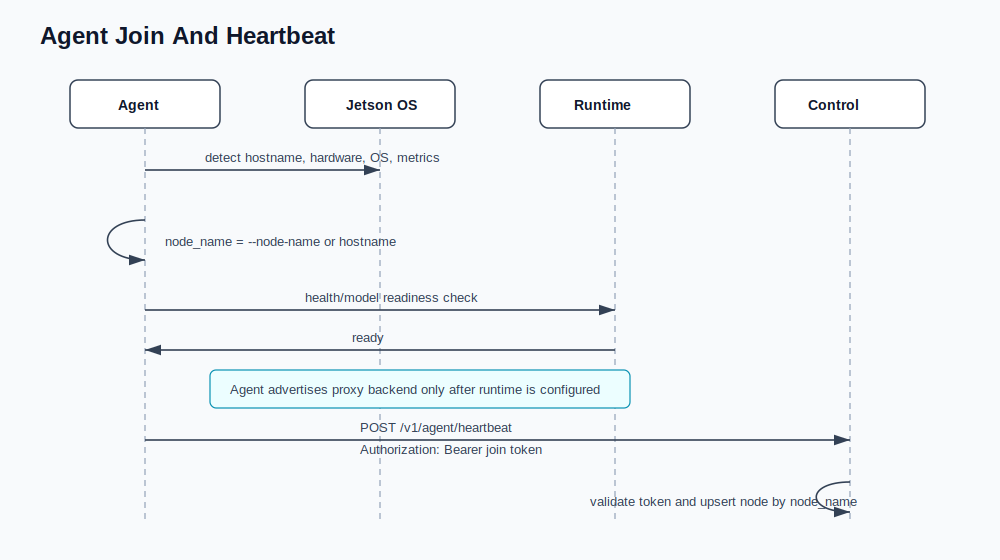
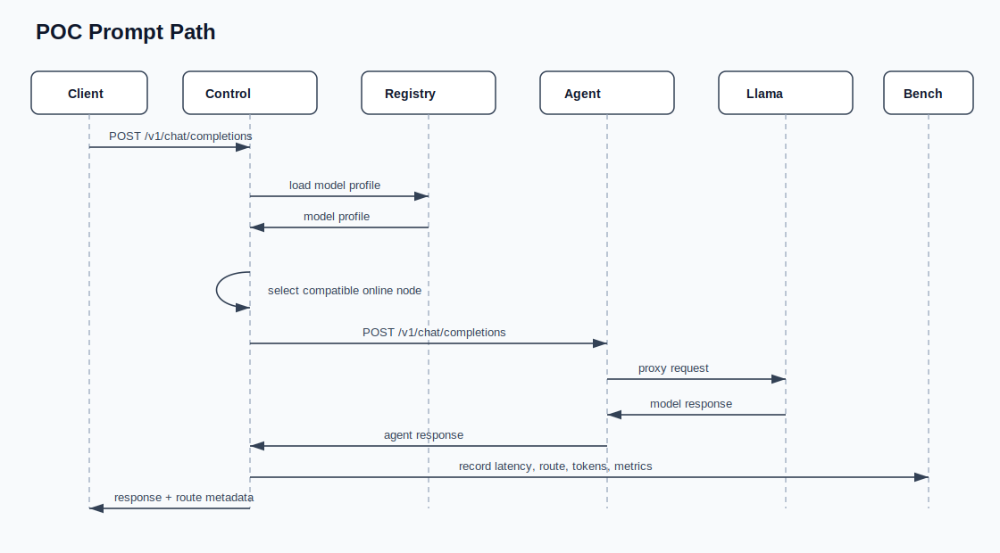
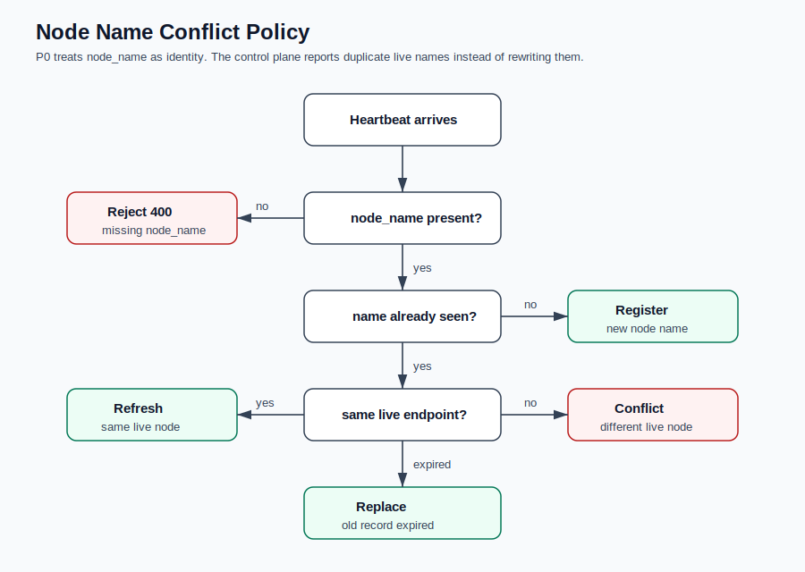

# Architecture Diagrams

These diagrams describe the intended JetsonFabric shape for the POC serving
baseline, P0/MVP layer split, and later runtime work. They are checked in as SVG
files so GitHub renders them as normal markdown images without depending on
Mermaid support.

## POC Serving Component View

## P0/MVP Layer-Split Component View

## Model Registry And Artifact Flow

The control plane loads model metadata. It does not load model weights. Agents
and runtimes need local model artifacts before they can advertise or execute a
backend.

## Go Contract View

This is a package boundary view, not an inheritance diagram. Boundary structs
stay separate so API, storage, routing, transport, and benchmarks can evolve
independently.

## Agent Join And Heartbeat

## POC Prompt Path

## P0/MVP Layer-Split Path

In the P0/MVP layer-split path, the control plane plans and observes. It should
not relay activation tensors.

## Node Name Conflict Policy

For the POC and MVP, `node_name` is the identity. It defaults to the Jetson
hostname, so lab nodes can be named `dopey`, `grumpy`, and `sleepy`. Duplicate
live names are configuration conflicts rather than names the control plane
silently rewrites.
